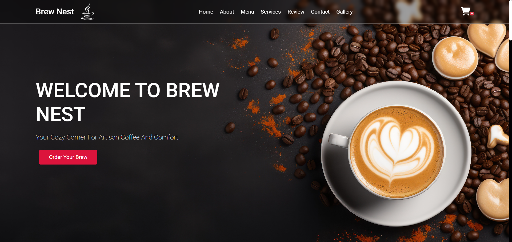

# ☕ BrewNest - Coffee Shop Website

**BrewNest** is a full-stack coffee shop web application that allows customers to browse and purchase coffee online. It also includes a powerful admin panel for managing products. Built using **Node.js**, **Express**, **MongoDB**, and **Handlebars**, this site provides a clean UI/UX and is fully responsive.

---

## 🚀 Features

### 👤 Guest Users (Customers)
- View coffee, tea, and snack products
- Browse product descriptions, prices, and images
- Add products to cart
- Place orders
- Responsive interface for mobile and desktop

### 🔐 Admin Panel
- Add new product (with image and optional video)
- Edit existing product details
- Delete product
- View all listed products
- View all orders

---

- **Frontend**: HTML, CSS, Bootstrap, JavaScript
- **Backend**: Node.js, Express.js
- **Database**: MongoDB
- **Templating Engine**: Handlebars (hbs)


### 🏠 Homepage 


### 🧾 Admin Panel


> Watch how BrewNest works in action:  
[Click here to watch the video](public/videos/BrewNest.mp4)

## 📦 Getting Started

### 1. Clone the Repository

```bash
git clone https://github.com/rahulmd03/BrewNest-CoffeeShop.git
cd BrewNest-CoffeeShop


